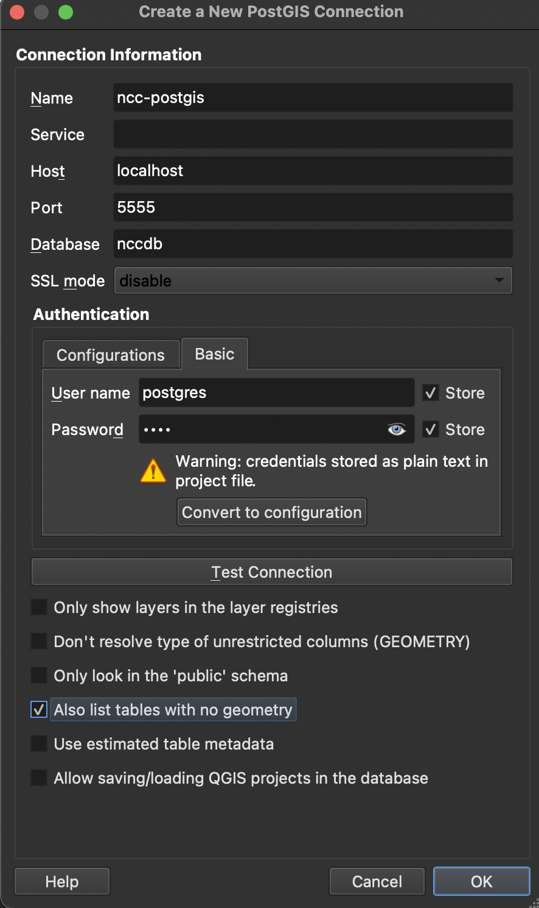

## Connecting QGIS

1. Navigate to `Layer > Add Layers > Add PostGIS Layers`.

2. Create a new database connection by pressing `New`.

3. Input the following information.

https://scdm.geography.wisc.edu/2020/12/08/spatial-database-connect-to-postgresql-postgis-through-qgis/