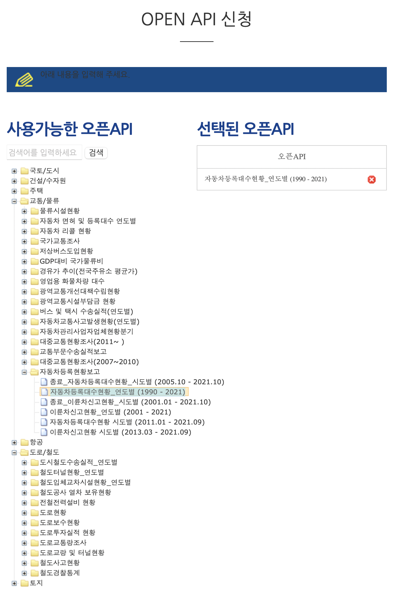
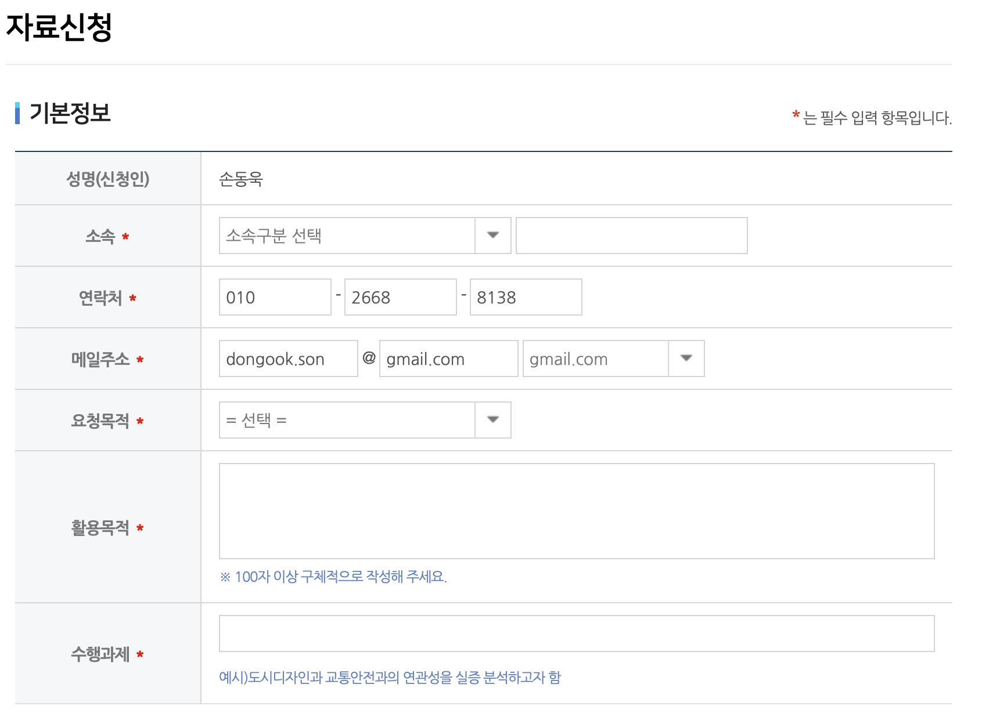

# Data Aggregation and Cloud Database Guideline for Air Pollutant Prediction Models

## Introduction

This article contains updates for the vastly detailed data aggregation manual originally written by Gyuheon Yang and additional concepts/features to automate the collection and migration of these data into an aggregated cloud-based database or datalake.

The cloud service provider will be AWS, as it offers affordable baremetal instances to serverless functions that can automate data cleaning process. Also, researchers can later on easily/rapidly load data from the Virtual Private Cloud(VPC) with an hosted web-based RStudio or Juptyer EC2 instance without the need for configuring their local machines. 


Geographic variables are comprised of the following data,

- Traffic
    - Road network: Distance to nearset roads, sum of road lengths
    - Vehicle registration
- Demographics(Census)
    - People
    - Households
    - Housing Buildings: # of housing buildings by type and construction year
    - Companies: # of companies & employees 
- Land Use(Land cover map)
    - proportion of residential, industrial, commercial, cultural, transportation, public facilities,agriculture,forestation,grassland, wetland, bareground, water

- Transportation Facilities
    - distances to the nearest to,
        - railroad, subway stations
        - bustop
        - airport
        - major ports
- Physical Geography
    - distances to
        - river
        - coastline
        - DMZ
- Emission
    - proportions of major pollutants(CO, NOX, SOX, TSP, PM10, VOC, NH3)
- Vegetation
    - Annual summary of NDVI
    - Median value in August for previous, current and following years
- Altitude
    - Absolute elevation
    - Proportion of concentric elevation points above or below 20/50m. 

The following table from the previous guideline[^1] illustrates the data source and format for the data above.


## Data Accumulation

### Traffic
1. Login to [KTDB](https://www.ktdb.go.kr/)
2. 정보공개 > 자료신청
	1. 교통망 GIS DB
	2. 전국
	3. Select desired year
3. 신청서 작성
	1. 신청유형 > 개인연구, 논문, 개인활용
	2. 기본정보 입력
	3. 통계자료 활동분야 > 교통량 분석, 원단위 적용, 기초현황 분석, 참고자료
	4. 통계자료 사용목적 
		1. 자료사용목적 : 미세먼지 대기오염 예측 모델 구축 연구 활용
		2. 자료제공사례 공개여부 : 공개
		3. 자료사용기간 : 신청당일로부터 약 한달 선택
4. After validation, extract `TM-KA_MR-LLV2` link data.
5. Create a file called `TM_SINGLE_POINT` and paste the following content.
	```bash
	$ touch TM_SINGLE_POINT.prj
	$ vi TM_SINLE_POINT.prj
	PROJCS["Tokyo_Transverse_Mercator",GEOGCS["GCS_Tokyo" ,DATUM["D_Tokyo",SPHEROID["Bessel_1841",6377397.155,299 .1528128]],PRIMEM["Greenwich",0.0],UNIT["Degree",0.0174532 925199433]],PROJECTION["Transverse_Mercator"],PARAMETE R["False_Easting",400000.0],PARAMETER["False_Northing",60 0000.0],PARAMETER["Central_Meridian",128.0000],PARAMET ER["Scale_Factor",0.9999],PARAMETER["Latitude_Of_Origin", 38.0],UNIT["Meter",1.0]]
	```

6. Extract MR1, MR2, Other(All roads)
	1. MR1 : highway(`101`), city highway(`102`)
	2. MR2 : $101 \cup 102 \cup LANES \ge 6$
	3. All roads : All other roads

*[UPDATE]*

If you have requested years of data in bulk and the requested data contains spatial information regarding the Metroplotian area, download scripting is required since the batch download tool does not work. 


### Vehicle Registration
1. https://stat.molit.go.kr/portal/main/portalMain.do
2. 교통/물류 > 승인통계 > 자동차등록현황보고 > 자동차등록대수_시도별 > 관련파일
http://stat.molit.go.kr/portal/cate/statFileView.do?hRsId=58&hFormId=5498&hSelectId=5498&hPoint=00&hAppr=1&hDivEng=&oFileName=&rFileName=&midpath=&month_yn=N&sFormId=5498&sStart=202109&sEnd=202109&sStyleNum=2&EXPORT=
3. Unlike the previous guideline, downloading the `canvas` is unavailable. 

Therefore, a newer approach is required via the [Molit OpenAPI Service](https://stat.molit.go.kr/portal/api/main.do).

0. Create `molit` openapi account. https://stat.molit.go.kr/portal/auth/memberJoin1.do

1. Request service key. https://stat.molit.go.kr/portal/api/auth/apply.do
   Note that the service key is immediately generated upon registration.

   1. 사용목적 및 활용용도: 미세먼지 대기오염 예측 모델 구축 연구 활용
   2. 서비스 URL: https://www.ncc-gcsp.ac.kr:8443/n_academics/kimsunyoung.jsp
   3. 설명: 미세먼지 대기오염 예측 모델 구축을 위해서는 교통망, 지역별 차량등록대수, 항만 위치 데이터 등 다양한 요인들과 코호트 환자의 거리를 측정한 지리변수들이 필요하기 때문에 이에 따라 신청함.

2. Request OpenAPI access. https://stat.molit.go.kr/portal/api/open/list.do

3. `사용가능한 오픈API > 교통/물류 > 자동차등록현황보고 > 자동차등록대수현황_시도별 (1990 - 2021)`

   1. 
   2. 오픈API 사용목적: 미세먼지 대기오염 예측 모델 구축을 위해서는 지역별 자동차등록대수 현황과 코호트 환자의 거리를 측정한 지리변수들이 필요하기 때문에 이에 따라 신청함.
      - `중복된 목록...` 이슈가 발생할 수 있음. 그러나 이는 사실 불필요한 과정임. API endpoint URL에 사전에 본인이 발급받은 인증키를 사용하면 내려받기가 가능함

4. Test with `wget` or `Postman`.

   ```sh
   wget  http://stat.molit.go.kr/portal/openapi/service/rest/getList.do?key=인증키&form_id=5559&style_num=1&start_dt=201303&end_dt=201303
   ```

### Census

1. login to https://sgis.kostat.go.kr/
2. 집계구별 인구, 가구, 주택, 사업체 Data를 신청하여 txt 형식의 data를 취득

*Census* 자료 획득을 위한 다음의 양식이 필요함.



### Landuse

### Railroads

### Airport, Ports

### Bus stops

### NDVI

### Emission

### Altitude


---

## New Ideas?

- Source
  - KOSIS
  - MDIS
  - 국가지표체계
  - SGIS plus
- 지리변수를 활용한 다양한 연구 예시 제시하기
  - https://chs.kdca.go.kr/chs/recsRoom/dataBaseMain.do


---

## Reference

[^1]: Computation of geographic variables for airpollution prediction models in South Korea, Eum, 2015
[^2]: Geodatabase: Best Practices, Flanagan M., ESRI Federal GIS conference, 2019
